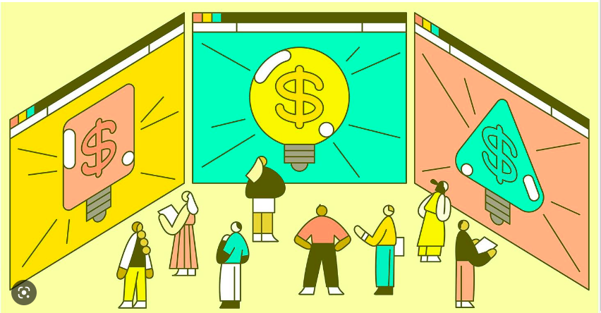
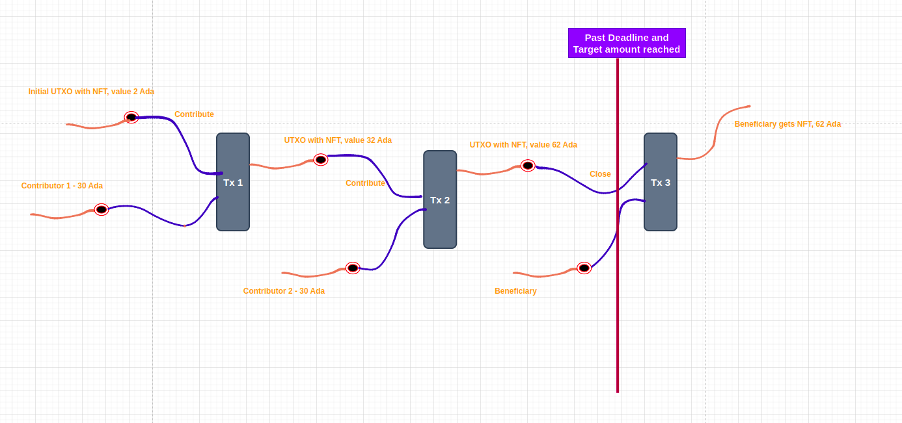
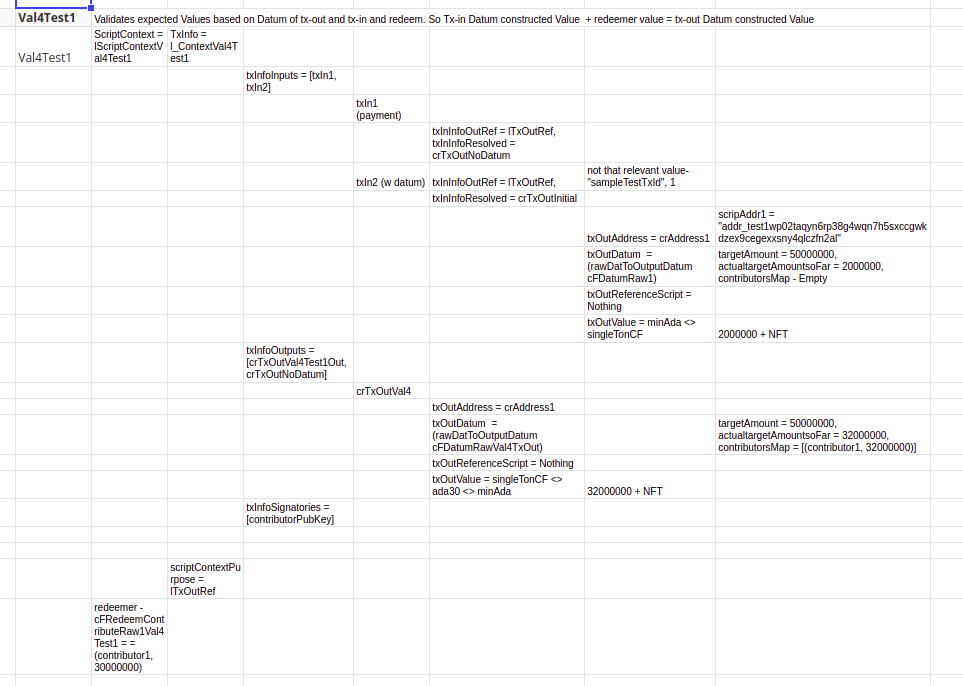
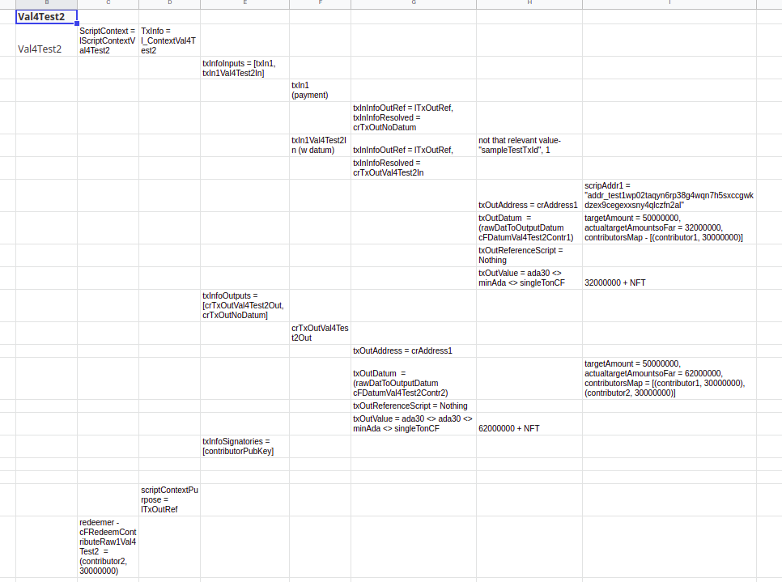

# Crowd Funding





https://medium.com/securitize/introducing-web3-crowdfunding-4d0e5cc6f0f7


https://thedefiant.io/web3-crowdfunding

Web3 holds the promise of transforming crowdfunding to levels beyond the capabilities of Web2. To realize this potential, we must fully adopt both the trust-minimizing principles and technological advancements of Web2.

Web2 platforms such as Kickstarter, GoFundMe, and WeFunder, have empowered individuals, non-profit organizations, and startups to seek funding from their communities through donations and even investment. This has been a major development. However, there are still shortcomings with these Web2 platforms that we all acknowledge.


### Marginalized Groups


The initial challenge with Web2-based crowdfunding is limited access, which results in reduced funding opportunities and exacerbates unequal distribution of resources. This excludes various groups from participating, including individuals from countries with sanctioned or authoritarian governments, marginalized communities such as sex workers, and regions without proper financial payment infrastructure.

The second issue is the imbalance of power and responsibility in Web2 crowdfunding. These platforms are operated by large, centralized companies, which gives them significant market power to charge excessive fees. Furthermore, their centralization makes them susceptible to government intervention or executive decisions that restrict access to potential funders.


Moreover, there is a subtler but potentially more significant issue - the majority of projects that use these platforms for crowdfunding are centralized organizations themselves. Funders are required to rely on their trustworthiness in fulfilling their commitments. There is a widespread reputation for Kickstarter projects to miss their delivery targets, and even reputable charitable organizations are not exempt from this.

### Ease of Use 

Web3 crowdfunding platforms are based on globally accessible cryptocurrency systems, eliminating the barriers and difficulties associated with Web2 platforms. This global and hassle-free nature has played a key role in the recent growth of Web3 crowdfunding, as seen in the success of Constitution DAO.

How do they operate? A typical Web3 crowdfunding platform, such as Juicebox and Mirror, accepts ETH from investors and returns a token as a proof of receipt. Tokens, which are made possible by the versatility of Web3, can serve various purposes. Some crowdfunding projects use their tokens as a simple representation of the investors' contributions, while others use it as a form of governance token. Regardless of the purpose, tokens are highly popular as people enjoy owning and possessing tokens, even if they don't necessarily confer any rights.


[Source]: https://thedefiant.io/web3-crowdfunding


https://securitize.io/raise-capital/web3-crowdfunding#:~:text=Known%20as%20the%20next%20generation,costly%20third%2Dparty%20integrations%20and

Leverage the power of Web3

Web3 is recognized as the future of the internet. It transforms the traditional cloud-based web into a decentralized platform where users can directly transfer value among each other. In this new ecosystem, tasks such as user registration, contract signing, and token receipt are completed using a user's cryptocurrency wallet, eliminating the need for expensive third-party services and reducing compliance worries.


Investors can easily connect their crypto wallet to purchase Security Tokens with USDC and instantly receive their digital assets.


Easily reward token holders and manage governance in a fully transparent way, turning your fans into loyal shareholders and brand evangelists.


Regulatory requirements, such as jurisdictional restrictions are automatically enforced via smart contracts.


Gain real-time access to your cap-table and its activity, providing you with valuable insights on shareholder activity.


Tokens can be transferred 24/7 and easily integrate with secondary markets, where investors enjoy the benefits of instant settlement without counterparty risks.


All operations are managed via Securitize and signed with the investor’s wallet, without the need for any paperwork.


### The Crowd Funding Smart contract 


This smart contact will help anyone who wants to raise money through Crowd Funding on public block-chain Cardano. Its generic Smart contract so anyone can use it to raise Funds. So it can be used to run as many Crowd Funding ventures as needed by anyone.  

The methodology used is an unique one and only NFT will always be present on UTXO that will gather all the crowd funded Ada. The very first time the Beneficiary (or anyone can too specifying a Beneficiary who will collect the funds) starts off with depositing an NFT at the script to kick off the Crowd Funding venture. This is the initial UTXO with NFT. This NFT is our thread token that will track this particular Crowd Funding venture.

When a contributor wants to contribute they will spend this unique UTXO with NFT and write it back to script with this NFT with any Ada already present and additionally the amount they are contributing. This is serialized in this way to keep track of Target amount. 





1. Beneficiary 
   1. Beneficiary is the person who will get the funds raised by this contract. This is represented by public hash key of the Beneficiary. Only this address can get the funds.
   2. Only if the target is reached the Beneficiary can collect the amount and also past the Deadline
2. Deadline - will allow us to set a deadline for the Fund contribution and collection. 
3. A unique one and only NFT will  manage this contract. The NFT will always sit at the UTXO that has all the Ada being collected at the script.
4. Contributors 
   1. Contributors can contribute to this Smart contract until the deadline is reached
   2. Smart contract will also keep track of who is contributing through the Contributor's public key hash and also amount they contribute. 
5. Target amount - a target amount is first specified by the beneficiary. 
6. 2. 


This Crowd Funding smart contract is developed on Cardano blockchain using `Plutus`.

This same contract can be used for multiple Crowd Funding ventures by anyone.


#### On-Chain 

Somebody wants to start a Crowd Funding campaign they will first create an NFT (Non-fungible token) - a native token on Cardano that exists only once just to create like an identifier for this Crowd Funding campaign. So this NFT is not necessarily has any much value as such since its only used as a Unique Identifier 

##### Crowd Funding State (Datum)

Our Datum will represent the State of the Crowd Funding campaign & will have below info:

1. Beneficiary - who is running this Crowd Funding campaign and will collect the money
2. Deadline - this deadline it up to which contributors can contribute and only after which Beneficiary can withdraw. 
3. NFT - this will be to identify this particular Crowd Funding campaign.
4. Target Amount - this represent how much is planned to raise. Beneficiary can only withdraw funds if this is reached.
5. Actual Target Amount so far - this represents how much was collected so far
6. Contributors Map - this keeps track of every contributor and their Amount they contributed.

```haskell
data Dat = Dat 
    {
        beneficiary :: Ledger.PaymentPubKeyHash
        , deadline :: LedgerApiV2.POSIXTime
        , aCurrency :: LedgerApiV2.CurrencySymbol
        , aToken    :: LedgerApiV2.TokenName
        , targetAmount :: Integer
        , actualtargetAmountsoFar :: Integer
        , contributorsMap :: [(Ledger.PaymentPubKeyHash,Integer)] 
    } deriving P.Show
PlutusTx.unstableMakeIsData ''Dat
```

We represent this above Crowd Funding State as a UTxO. The UTxO sits at the script address of the Crowd Fund smart contract, and its datum field it carries the current state of the crowd funding data.

Since validation only happens when you want to consume something from a script address, not when you produce an output at a script address. This means that we can’t prevent anybody producing arbitrary outputs at the script address.

Somehow we need to distinguish the true Crowd Fund output from other outputs that may be sitting at the same script address. And the way we do this is to put an NFT on the output. Because an NFT can only exist once, there can only be one UTxO at the script address that holds the NFT.


Now, the Crowd Funding validator has to check several things.

1. Is the NFT present in the consumed input?
2. Is there an output from the transaction at the same address containing the same NFT?
3. Is the value in the output UTxO the same as the input value?
4. Is the fee present?

Now we can complete the transaction.


### To do - 

1 - show 2 Crowd Funding Campaigns working

2 - show some error cases too

3 - Show some visual UTXOs diagrams etc.

3 - Out of scope and some future validations - due to lack of time some validations like 

- if target amount it not reached is not implemented. 
- Ideally we want to contributors to then withdraw their funds. 
- And also withdraw anytime before the deadline is reached.
- Deadline for Contribution also was not implemented due to lack of time. Its a minor thing that can be added.

- Few visual diagrams of UTXO's etc. Real case i did and another fail case. 

- Need to build a fail case to show.

  


### Fraud Prevention


#### Target Amount manipulation

One major flaw is that technically the Beneficiary can deposit difference to Target amount if its not met & so it always reached and withdraw that way. So later enhancements we will drop the target value and instead use just a deadline. or we will be doing KYC for the Beneficiary to act in good faith 

#### KYC for Beneficiary 

Smart contracts can be developed in different flavors. So while the Crowd Funding will be fully onchain the malpractice and consequences can be off Chained activities.

This is one option :

To prevent malpractice like Beneficiary collecting by manipulating target amount or laundering it for different purpose we will store KYC for Beneficiary as a hash on the blockchain that can be queried off Chain for his full KYC. and also any malpractice can be dealt off chain with a legal contract. 

For KYC there will be an outside major Legal entity player (some big famous law firm) that will verify that KYC was done and that hash will be also on the datum. Part of the KYC can be revealed to Contributors offChain based on whatever terms is agreed beforehand and will be announced off chain. Contributors can rely on the KYC based on the Legal firm ok-ing it. (this will  be like Notary for example - they validate their KYC is correct and give a hash). 

#### Legal binding

We will have the Beneficiary write up a Legal contract and we will store a hash on the blockchain. Contributors can verify that contract before starting to contribute. So there is legal binding offChain in the event contributors later find out of malpractice. This hash of Legal contract will be added to the Datum. That way contributor can keep an offchain copy of legal contract and this hash will validate that Beneficiary participation. Contributor can contribute only when they have copy of this legal document and verified it with hash. 


### Unit Testing


We create our own Haskell function based tests before we move on to actual Testnet.

We build our own Contexts which consists of txInfoInputs, txInfoOutputs, the datums, Value etc.

Below is couple of unit tests that was build and as it gets pretty huge we maintain a sheet that identifies each of these elements as they can very overwhelming very soon.

below is sample code block but it can be followed in the actual source code on the project.


#### OnChain validation#4

```haskell
-- OnChain validation#4
--           validation#4
-- --        Validates expected Values based on Datum of tx-out and tx-in - tx-in Value  + redeemer value = tx-out Value
             && traceIfFalse "Constructed Values calculated between tx-out Datum and TxIn datum plus Redeem is wrong" correctOutputDatumValue 
--    This validates value from Datum Tx-in, adds Redeemer to check the Datum tx-out is correct Value point of view.
      correctOutputDatumValue :: Bool
      correctOutputDatumValue =   case totalValueDatumTxOut of 
                               Just to -> ( to  ==  totalExpectedDatumTxInPlusRedeem)
                               Nothing -> False
```


#### Haskell function validation

```haskell


-- this is Haskell Function equivalent test for validation 4 one of the contributions.

-- Haskell validation
l_correctOutputDatumValueVal4test1 :: Bool
l_correctOutputDatumValueVal4test1 =   case (l_totalValueDatumTxOut l_outputsAllVal4Test1) of 
                         Just to -> ( to  ==  l_totalExpectedDatumTxInPlusRedeem l_redeemValueVal4Test1 l_inputsAllResolvedVal4Test1)
                         Nothing -> False


---------------------------------------------------------------------------------Validation#4 test 1
----- for correctOutputDatumValue validation

-- create the context for valiation 4 -
-- has Tx-in - initial input with 2 ada in txIn1
-- had Tx-out with crTxOutVal4

-- Step 1 - Build your context
-- Step 2 - Build the Tx-ins and Tx-out, signatories if needed
-- Step 3 - Build your DatumTxIn and DatumTxOut, and Datum to be passed, and Redeemer
-- 

--- Build Script context
lScriptContextVal4Test1 :: Contexts.ScriptContext
lScriptContextVal4Test1 = Contexts.ScriptContext {
    Contexts.scriptContextTxInfo = l_ContextVal4Test1,
    Contexts.scriptContextPurpose = Contexts.Spending lTxOutRef
}

l_ContextVal4Test1 :: Contexts.TxInfo
l_ContextVal4Test1 = Contexts.TxInfo {
              Contexts.txInfoInputs  = [txIn1, txIn2]    -- 2 TxInfoInputs, 1 is UTXO with NFT, and other just Payment addr for Fee or collaterals etc
             , Contexts.txInfoOutputs = [crTxOutVal4Test1Out, crTxOutNoDatum]   -- Contribution 1 + any other tx-out payment address like Change address ex.
             , Contexts.txInfoSignatories = [contributorPubKey]
-- Validation#4 test 1
}

--      Get all the tx-outs
l_outputsAllVal4Test1 :: [Contexts.TxOut]
l_outputsAllVal4Test1 = Contexts.txInfoOutputs l_txinfoVal4Test1 -- l_ContextVal4Test1

--      Get all the tx-ins
l_txinfoVal4Test1 :: Contexts.TxInfo 
l_txinfoVal4Test1 = Contexts.scriptContextTxInfo lScriptContextVal4Test1
```








### Validations


#### Redeem - Contributor validations

We could have used findOwnInputs too but we looks at all Tx-Ins. In some way it can this way avoid any maliciousness from any other Tx-In



->

--        This validates 3 parameters to be equal

--           1st parameter - from actual Tx-ins Values , validates that the UTXO with NFT in its Values - bypasses other Tx-in w/o NFT like Fees Tx-in

--           2nd parameter - Values calculated based on Datum passed to the Validator- since it’s Inline Datum would calculate Value based on this - adds up the contributors map it tracks plus the minAda. ( after changing to Inline Datum this becomes redundant but has been left in the code)

--           3rd parametr - Values calculated from Datum at the UTXO. (

--           validation#1

traceIfFalse "wrong input value" ( correctInputValue d )





Validation#2

&& traceIfFalse "Only 1 tx-in Datum allowed" only1ValidDatumTxIn

This makes sure no other unintended consequences or even mistakes or malicious multiple Tx-ins with datum are submitted. So just outright prevent it.





--           validation#3

--           -- i am expecting only 1 Datum in my tx-out to write back to the Script with NFT - so should not get more than one. Other Tx-out will only have Payment addresses like Change

&& traceIfFalse "Only 1 tx-out Datum allowed"  only1ValidDatumTxOut



Similarly even with Tx-out we only allow 1 with a datum. This to prevent any other unintended consequences or even any possible maliciousness since we know exactly what we want with Contribution - to just write back that NFT with Datum back to script.





--           validation#4

-- --        Validates expected Values based on Datum of tx-out and tx-in - tx-in Value  + redeemer value = tx-out Value

&& traceIfFalse "Constructed Values calculated between tx-out Datum and TxIn datum plus Redeem is wrong" correctOutputDatumValue

This one basically validates the Datum already on the UTXO plus redeemer will equal to the Datum being written to script. Since we expect the contribution value to be added to existing total on the spending UTXO datum.



Validation#5-

Validates the actual value at tx-out with calculated Value based on tx-out Datum

&& traceIfFalse "Actual tx-out Values and constructed Datum tx-out dont match" correctOutputValue

This is to ensure Value actually deposited & Datum submitted match



-- validation#6

-- -- tx-out - Datum collected amount should be updated with Tx-in amount + contributed amount

&& traceIfFalse "the ContributedSoFar amount has a descrepancy" correctTargetAmountSoFarDatum

This one we validate the TargetAmountSoFar collected. Basically before in the Datum of Tx-in should be updated with contributed amount when its written to script.



-- validation#7

-- -- tx-in and tx-out - Beneficiary, Deadline and Target amount should be same.

&& traceIfFalse "Datums check: Either beneficiary , deadline or targetAmount is not matching" correctRestDatum

These values are static that dont change throughout this unique Crowd Funding campaign. So we make sure the Datum being written to script matches what was spent from UTXO.



-- validation#8

-- -- The tx-out Contributors map should be tx-in Contributor map + Redeem map

&& traceIfFalse "Datums check: Contributors map is not added correctly" correctContributionMapDatum

This one validates the Contributors map is correctly built. Basically the new Contributor adds their own Contributor hash and amount to the existing Contributor map. This is stored in Datum value.



-- validation#9

-- -- Scripts address validations for Tx-in and Tx-out

&& traceIfFalse "Scripts address validations for Tx-in and Tx-out fail" addressValidation

we make sure the Tx-in at script and tx-out with Datum - its script address matches. Just ensures our Crowd Datum script is the one in both Tx-in and Tx-out (note - we already filter out the Payment addresses so we compare only SCript address remaining Tx-in and Tx-outs)



--           validation#10

-- --        Contributor has to sign

​             && traceIfFalse "Not signed by contributor" (signedByContributor $ fst cmap)

Contributor has to sign as it comes from their wallet.


--           validation#11

​             && traceIfFalse "Redeem amount has to be min 1 Ada" (contributionAmountRedeemer $ snd cmap)

This was to just ensure we are not flooded with malicious small contribution amounts to inundate the Crowd Fund. 


--           validation#12

​          -- && traceIfFalse "Deadline reached - no more contributions" (not deadlinepassed)

this allowed contributors to contribute only till this deadline. After this they cannot contribute anymore.

This was temporarily disabled to make it easier for the project but will be added back for real deployment.


#### Redeem - Close validations for Beneficiary

--        validation#13

​          traceIfFalse "UTXO being spend values are not matching based on Datum" correctInputValueClose

This one checks the value at the UTXO being spent and is matching the Datum. This should match if everything went well and contributions happened correctly.


--        validation#14

​          && traceIfFalse "Target amount not reached" closeTargetAmountValid

This validated the Target amount of Crowd Fund campaign is reached otherwise it will NOT let Beneficiary withdraw.


--        validation#15            

​          && traceIfFalse "Not signed by beneficiary" signedByBeneficiary

Beneficiary needs to sign to make sure right one gets the funds. This Beneficiary pubkeyHash is stored in Datum and only they can withdraw.


--        validation#16

--         --Only 1 tx-in with datum allowed- other can be payment address fee etc. which dont have datum

​          && traceIfFalse "Only 1 tx-in Datum allowed" only1ValidDatumTxIn 

This validates there is only 1 Tx-in with a Datum.


--        validation#17

​          && traceIfFalse "Deadline not yet reached" deadlinepassed

This lets Beneficiary withdraw only after the deadline has passed.


