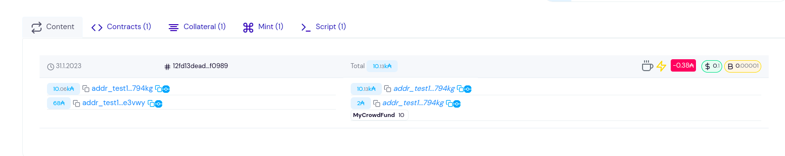
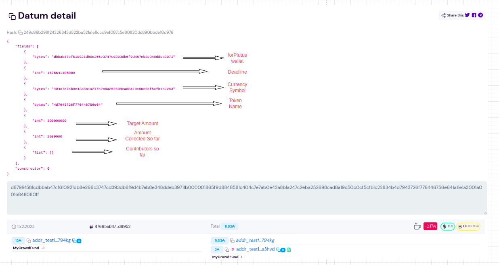
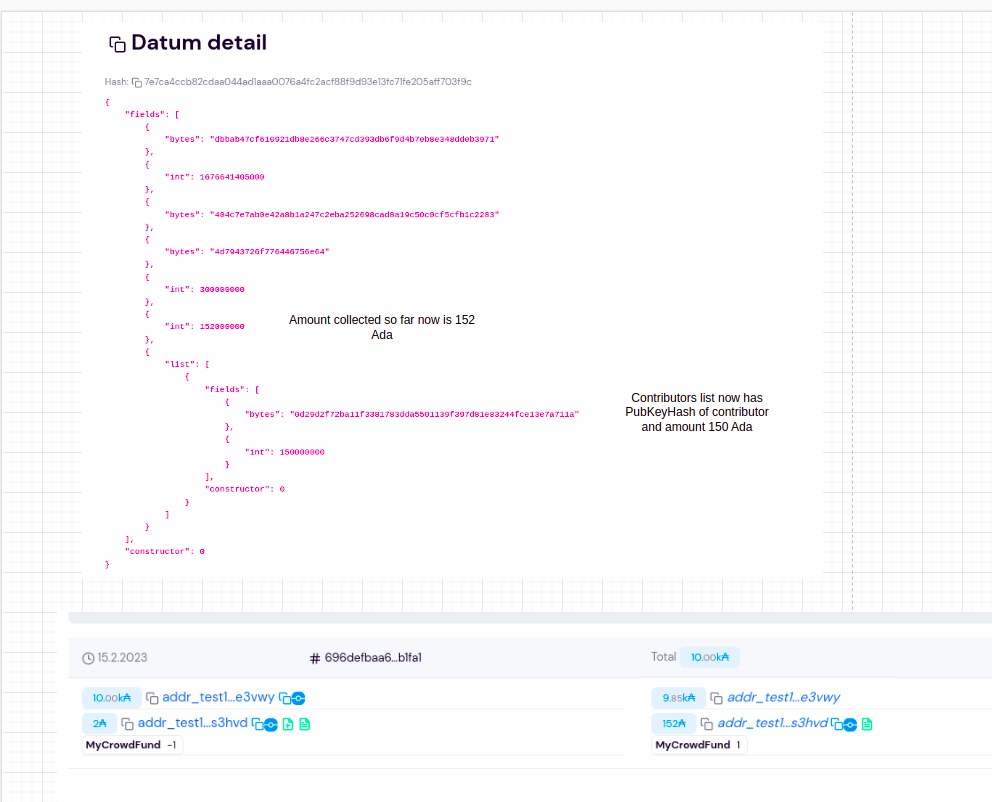
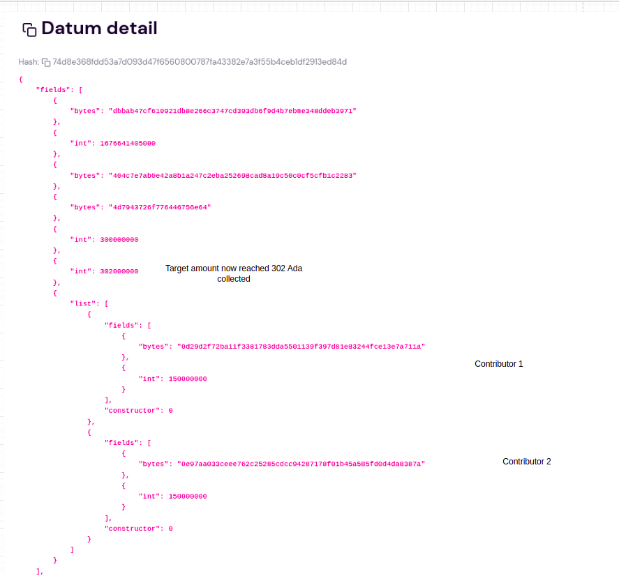
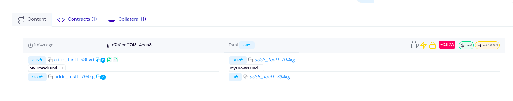
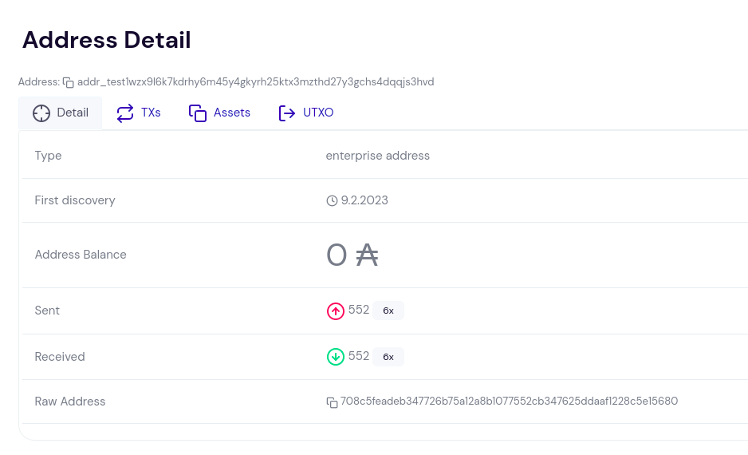
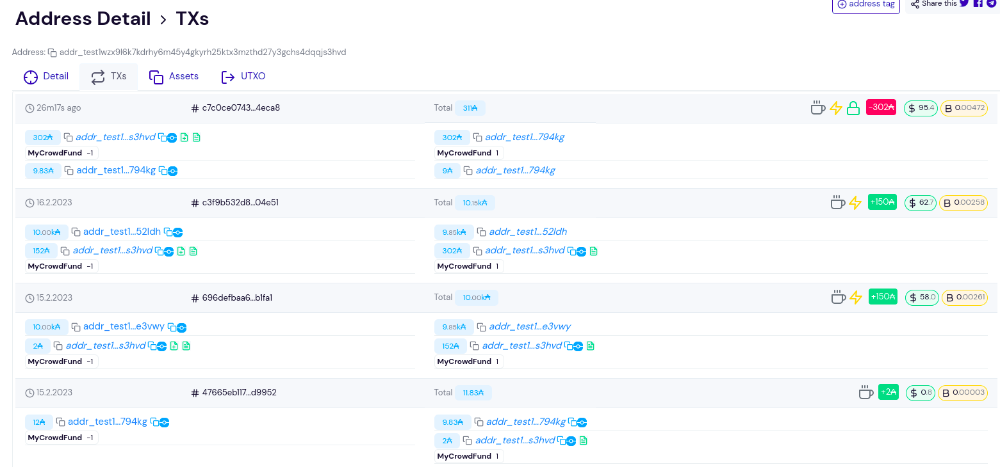
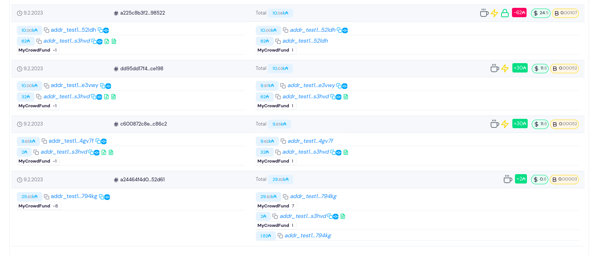

# Crowd Funding


Web3 holds the promise of transforming crowdfunding to levels beyond the capabilities of Web2. To realize this potential, we must fully adopt both the trust-minimizing principles and technological advancements of Web2.

Web2 platforms such as Kickstarter, GoFundMe, and WeFunder, have empowered individuals, non-profit organizations, and startups to seek funding from their communities through donations and even investment. This has been a major development. However, there are still shortcomings with these Web2 platforms that we all acknowledge.


## The Crowd Funding Smart contract 


This smart contact will help anyone who wants to raise money through Crowd Funding on public block-chain Cardano. Its generic Smart contract so anyone can use it to raise Funds. So it can be used to run as many Crowd Funding ventures as needed by anyone.  

The methodology used is an unique one and only NFT will always be present on UTXO that will gather all the crowd funded Ada. The very first time the Beneficiary (or anyone can too specifying a Beneficiary who will collect the funds) starts off with depositing an NFT at the script to kick off the Crowd Funding venture. This is the initial UTXO with NFT. This NFT is our thread token that will track this particular Crowd Funding venture.

When a contributor wants to contribute they will spend this unique UTXO with NFT and write it back to script with this NFT with any Ada already present and additionally the amount they are contributing. This is serialized in this way to keep track of Target amount. 

In the end once target is met and deadline is passed the Beneficiary can collect the funds.

The OnChain code will do all the validations necessary so this execution happens  and provide necessary safe guards and no other malicious actors can hijack the contract and drain money etc. 


#### On-Chain 

The UTXO at the script will carry this information on a Datum as a State of the crowd funding venture.

[`CrowdFundingOnChain.hs`](https://github.com/rchak007/CrowdFundingCardanoPlutus/blob/main/src/CrowdFunding/CrowdFundingOnChain.hs)

##### Crowd Funding State (Datum)

1. Beneficiary 
   1. Beneficiary is the person who will get the funds raised by this contract. This is represented by public hash key of the Beneficiary wallet address. Only this address can get the funds.
   2. Only if the target is reached the Beneficiary can collect the amount and also past the Deadline
2. Deadline - will allow us to set a deadline for the Fund contribution and also collection. 
3. A unique one and only NFT will  manage this contract. The NFT will always sit at the UTXO that has all the Ada being collected at the script.
4. Contributors 
   1. Contributors can contribute to this Smart contract until the deadline is reached
   2. Smart contract will also keep track of who is contributing through the Contributor's public key hash and also amount they contribute. 
5. Target amount - a target amount is first specified by the beneficiary as the goal of the Crowd Funding contract. If this is not reached the Beneficiary cannot withdraw amounts.
6. Actual Target Amount so far - this represents how much was collected so far


This Crowd Funding smart contract is developed on Cardano blockchain using `Plutus`.

This same contract can be used for multiple Crowd Funding ventures by anyone.

```haskell
data Dat = Dat 
    {
        beneficiary :: Ledger.PaymentPubKeyHash
        , deadline :: LedgerApiV2.POSIXTime
        , aCurrency :: LedgerApiV2.CurrencySymbol
        , aToken    :: LedgerApiV2.TokenName
        , targetAmount :: Integer
        , actualtargetAmountsoFar :: Integer
        , contributorsMap :: [(Ledger.PaymentPubKeyHash,Integer)] 
    } deriving P.Show
PlutusTx.unstableMakeIsData ''Dat
```

We represent this above Crowd Funding State as a UTxO. The UTxO sits at the script address of the Crowd Fund smart contract, and its datum field it carries the current state of the crowd funding data.

Since validation only happens when you want to consume something from a script address, not when you produce an output at a script address. This means that we can’t prevent anybody producing arbitrary outputs at the script address.

Somehow we need to distinguish the true Crowd Fund output from other outputs that may be sitting at the same script address. And the way we do this is to put an NFT on the output. Because an NFT can only exist once, there can only be one UTxO at the script address that holds the NFT.


Now, the Crowd Funding validator has to check several things.

1. Is the NFT present in the consumed input?
2. Is there an output from the transaction at the same address containing the same NFT?
3. Is the value in the output UTxO the same as the input value?
4. Is the fee present?

Now we can complete the transaction.


##### Crowd Funding Redeem Actions

Redeem actions are Contribute and Close.


###### 

```haskell
data Redeem = Contribute 
    {
        contribution :: (Ledger.PaymentPubKeyHash,Integer)
    } 
              | Close 
    deriving P.Show
```


###### Contribute 

With this redeem action Contribtute a contributor will provide their pubKeyHash and amount they are contributing.

Also since we write the script UTXO we consume back the script we need to provide the new Datum too and this Datum's fields need to reflect the correct Value being added. So the new Datum, Redeem and actual value at script UTXO (NFT + already held Value + new contribution) should all be correctly formed. otherwise there will be error.

Note- deadline reached was commented out to make it easier for testing. But in real contracts we will have this turned on.


###### Close

Beneficiary can collect all the Ada from Crowd Fund contract when Target Amount is met and deadline is passed.


#### Create .plutus datums and redeem

Next we use `CrowdDeploy.hs` to create the `CrowdFunding.plutus` , different datums that we need to write back to script, redeem file.

We use boilerplate code that takes the validator and eventually converts to a .plutus file.

```haskell
writeValidator :: FilePath -> LedgerApiV2.Validator -> IO (Either (FileError ()) ())
writeValidator file = writeFileTextEnvelope @(PlutusScript PlutusScriptV2) file Nothing . PlutusScriptSerialised . SBS.toShort . LBS.toStrict . serialise . LedgerApiV2.unValidatorScript

```

Similarly we use some boiler plate to create our Datum and Redeem files.

[`CrowdDeploy.hs`](https://github.com/rchak007/CrowdFundingCardanoPlutus/blob/main/src/CrowdFunding/CrowdDeploy.hs)


### Minting NFT


It first starts with the Beneficiary first minting a unique NFT which will identify their Crowd Funding UTXO.

We have the `MintBurn.hs` policy script which takes a unspent UTXO to make this NFT unique. This script makes sure only a unique NFT is generated.

We have a parameterized script with an Unspent UTXO, name of token and the minter pubKeyHash.

```haskell
data TokenParam = TokenParam
    {
        utxo :: LedgerApiV2.TxOutRef,
        name :: LedgerApiV2.TokenName,
        minter :: Ledger.PaymentPubKeyHash
    }
```


And in `MintingDeploy.hs` we define the values of this parameter and create our `MintBurn.plutus` script.


### Instructions to Executing the Crowd Funding Contract


#### STEP 1 - Mint NFT

[mintFromScript.sh](https://github.com/rchak007/CrowdFundingCardanoPlutus/blob/main/shell-scripts/mintFromScript.sh)

We use the `mintFromScript.sh` shell script which will construct the transaction to mint a Unique NFT to the Beneficiary address.

At the top of the shell script i have created some variables which we can pre-set to make the run easier and also when we run the script there few questions like which UTXO you are spending to create the NFT (which was specified in the parameters of the MIntBurn script) and the shell script will execute to mint the NFT and send it to the Wallet you chose.

```bash
# Input for this run only 
SCRIPT_NAME=MintBurn
UTXOWALLET=forPlutus
LOVELACE_TO_SEND=12000000    # send more than min 2Ada otherwise issues in PayToScript
TO_WALLET_NAME=forPlutus
COLLATERAL=Collateral
TOKEN_NAME=MyCrowdFund
TOKEN_QUANTITY=1
REDEEMER_FILE=redeemer-mint.json
```


Note - since i was testing i minted 10 NFT's so i can repeat lot of tests. But production script will only allow 1 which will be coded in the Onchain logic itself to check too.


#### STEP 2 - Pay the NFT to the script

[payToScriptCrowdFund.sh](https://github.com/rchak007/CrowdFundingCardanoPlutus/blob/main/shell-scripts/payToScriptCrowdFund.sh)

Beneficiary now has to deposit the NFT at the Script to start off the Crowd Funding.

We will use the shell script `payToScriptCrowdFund.sh` which will construct the transaction to take the NFT from their wallet and pay to the script.

Again at the top of shell script i have set some variables to make the run easier. Especially useful when testing and resolving errors since we run multiple times. 

```bash
# Set this for this Current run so for multiple runs no issues
SCRIPT_NAME=CrowdFunding
LOVELACE_TO_SEND=2000000  #-- 2 Ada initial
DATUM_HASH_FILE=crowdFunding-datum
SELECTED_WALLET_NAME=forPlutus
TOKEN_QUANTITY_SCRIPT=1
```

After this step we should have a UTXO at the Crowd Funding Contract which has the NFT created from Step1 and also with the Initial datum.


#### STEP 3 - Contribution 

[spendFromScriptCrowdFund.sh](https://github.com/rchak007/CrowdFundingCardanoPlutus/blob/main/shell-scripts/spendFromScriptCrowdFund.sh)

To contribute the contributor will spend the UTXO at the script with the Unique NFT and add the contribution amount and pay it back to the script with this unique NFT.

This script will construct the transaction to made this happen. 

Again we preset lot of the info to make the transaction building easier by specifying the Script file info, Wallets contributing, datum info, redeem info, signing key files etc. 

```bash
# Set this for this Current run so for multiple runs no issues
SCRIPT_NAME=CrowdFunding

# TO_WALLET is contributor when redeem is Contribute and When its close its the Beneficiary wallet
# TO_WALLET_NAME=Contributor    
# COLLATERAL=Contributor
# TO_WALLET_NAME=Collateral    # contributor 1 for 2nd run
# COLLATERAL=Collateral        # we use the same contributor 1 wallet - one of the UTXO as colleteral too

# TO_WALLET_NAME=Beneficiary    # Contributor 2 for the 2nd run
# COLLATERAL=Beneficiary        # collateral for the Txn from same Contributor 2 wallet

TO_WALLET_NAME=forPlutus    
COLLATERAL=forPlutus
CLOSE_PAYMENT=302000000

#DATUM_HASH_FILE=crowdFunding-datumOut    # first contribution
DATUM_HASH_FILE=crowdFunding-datumOut2   # 2nd contribution
#REDEEMER_FILE=crowdFundingContribute-redeem
#REDEEMER_FILE=crowdFundingContribute-redeem2
REDEEMER_FILE=crowdFundingClose-redeem
#WRITING_BACK_TO_SCRIPT=Y      # when we contribute this needs to be uncommented
TOKEN_QUANTITY_SCRIPT=1

SIGNER1=$(cat $BASE/.priv/Wallets/$TO_WALLET_NAME/$TO_WALLET_NAME.pubKeyHash)
# SIGNER1=0d29d2f72ba11f3381783dda5501139f397d81e83244fce13e7a711a
SIGNER_FILE1=$BASE/.priv/Wallets/$TO_WALLET_NAME/$TO_WALLET_NAME.skey
```


We repeat this contribution step with how many ever contributions that can be done.


#### STEP 4 - Close  

[spendFromScriptCrowdFund.sh](https://github.com/rchak007/CrowdFundingCardanoPlutus/blob/main/shell-scripts/spendFromScriptCrowdFund.sh)

Once the deadline is reached and Target Amount is also met the Beneficiary can now Close and claim the Ada at the UTXO at script with NFT.

we use the same script with different parameters that will construct the transaction to made this happen. 

Again we preset lot of the info to make the transaction building easier by specifying the Script file info, Beneficiary info, redeem info, signing key files etc. 

With this the Crowd Funding is over.


### Out of Scope / Future Improvements

Due to lack of time some of the below were not implemented but will be improved upon in future.

- It target amount it not reached by Deadline - right now the contract will just get stuck. But ability for contributors to withdraw their funds will be implemented in future. Right now we already created a Contributors list to know who contributed how much that can be utilized.

- Ideally we also want contributors to then withdraw their funds anytime before deadline as long as Target amount is NOT reached. This also will be done in future. 

- Deadline for Contribution also was not implemented due to lack of time. Its a minor thing that can be added.

- Also currently we used Inline datum concept which can be improved to Datum hash in future

  


### Implementing Crowd Funding on Cardano Testnet 

Below we go through the implementing 2 Crowd Funding campaign successfully using the same Crowd Fund contract as this allows multiple campaigns to be done.

Campaign 2 was done after Campaign 1.


#### Crowd Funding Campaign 2


##### Summary of Test

Campaign 2 Target Value is 300 ADA now.

We have Beneficiary as forPlutus Wallet (`addr_test1vrdm4dru7cgfy8dcufnvxaru6wfakmuafdlt3c6gmh4njugn794kg`).  

We create a new NFT to identify this campaign.

Contributor 1 will be Collateral Wallet (these are just my wallet names) will deposit 150 Ada.

Contributor 2 will be Beneficiary wallet - will deposit 150 Ada

Finally withdraw after target is reached.

There will 3 failed tests to do negative testing.


##### NFT UTXO

we will use UTXO `12fd13deadc8248eac08dc9ea782fff58350abf37a06abad36bbb28cdbff0989#1` at forPlutus to create new NFT.

https://preview.cexplorer.io/tx/12fd13deadc8248eac08dc9ea782fff58350abf37a06abad36bbb28cdbff0989


##### Mint NFT 


We use `mintFromScript` as described in the instructions to Mint the NFT.

```bash
+ cardano-cli transaction build --babbage-era --cardano-mode --testnet-magic 2 --tx-in 12fd13deadc8248eac08dc9ea782fff58350abf37a06abad36bbb28cdbff0989#1 --tx-in dd95dd17f46b3f93f1670e08565c5af46752dc8ad4ccdcb5ce72a3ebaddce198#1 --tx-out 'addr_test1vrdm4dru7cgfy8dcufnvxaru6wfakmuafdlt3c6gmh4njugn794kg+12000000+1 404c7e7ab0e42a8b1a247c2eba252698cad8a19c50c0cf5cfb1c2283.4d7943726f776446756e64' --change-address=addr_test1vrdm4dru7cgfy8dcufnvxaru6wfakmuafdlt3c6gmh4njugn794kg '--mint=1 404c7e7ab0e42a8b1a247c2eba252698cad8a19c50c0cf5cfb1c2283.4d7943726f776446756e64' --mint-script-file /home/chakravarti/emurgoCardano/plutus-scripts/MintBurn.plutus --mint-redeemer-file /home/chakravarti/emurgoCardano/plutus-scripts/redeemer-mint.json --tx-in-collateral=dd9 5dd17f46b3f93f1670e08565c5af46752dc8ad4ccdcb5ce72a3ebaddce198#1 --required-signer-hash 0d29d2f72ba11f3381783dda5501139f397d81e83244fce13e7a711a --required-signer-hash dbbab47cf610921db8e266c3747cd393db6f9d4b7eb8e348ddeb3971 --protocol-params-file /home/chakravarti/emurgoCardano/tx/pparams.json --out-file /home/chakravarti/emurgoCardano/tx/tx.draft
Estimated transaction fee: Lovelace 379893
+ cardano-cli transaction sign --tx-body-file /home/chakravarti/emurgoCardano/tx/tx.draft --signing-key-file /home/chakravarti/emurgoCardano/.priv/Wallets/Collateral/Collateral.skey --signing-key-file /home/chakravarti/emurgoCardano/.priv/Wallets/forPlutus/forPlutus.skey --testnet-magic 2 --out-file /home/chakravarti/emurgoCardano/tx/tx.signed
+ cardano-cli transaction submit --tx-file /home/chakravarti/emurgoCardano/tx/tx.signed --testnet-magic 2
Transaction successfully submitted.

```


(note - i minted 10 as it was testing and to make it easy to not mint again and again when testing would fail conditions and i would have to re-code the Crowd Fund contract but in production we would always mint only 1)




##### Start of the Crowd Fund

Now our beneficiary in this case is forPlutus Wallet (`addr_test1vrdm4dru7cgfy8dcufnvxaru6wfakmuafdlt3c6gmh4njugn794kg`). So as this wallet we first deposit this NFT to the script using `payToScript.sh` script. and also place a 2 Ada to get things started.

```bash
Your from UTXO is : c922b8fd03d54ee8ab8145834f853189fd8a192360f700dd5bb44ffb9f720bbd#0
cardano-cli transaction build --babbage-era --cardano-mode --testnet-magic 2 --tx-in c922b8fd03d54ee8ab8145834f853189fd8a192360f700dd5bb44ffb9f720bbd#0 --tx-out addr_test1wzx9l6k7kdrhy6m45y4gkyrh25ktx3mzthd27y3gchs4dqqjs3hvd+2000000+1 404c7e7ab0e42a8b1a247c2eba252698cad8a19c50c0cf5cfb1c2283.4d7943726f776446756e64 --tx-out-inline-datum-file /home/chakravarti/emurgoCardano/plutus-scripts/crowdFunding-datum.json --change-address=addr_test1vrdm4dru7cgfy8dcufnvxaru6wfakmuafdlt3c6gmh4njugn794kg --protocol-params-file /home/chakravarti/emurgoCardano/tx/pparams.json --out-file /home/chakravarti/emurgoCardano/tx/tx.draft
Estimated transaction fee: Lovelace 172277
Transaction with id:  47665eb1170c9c062239ddb29412a4f2a9808f92649207cb81d5e8c4362d9952
Sign and submit Pay to Script Tx? [Y/N]: y
You say Yes
Transaction successfully submitted.

```


https://preview.cexplorer.io/tx/47665eb1170c9c062239ddb29412a4f2a9808f92649207cb81d5e8c4362d9952


Below is the transaction on Testnet explorer + Datum 





##### Contribution 1 - 150 Ada

We will use the script `spendFromScript` to do the contrubution of 150 Ada. Since we spend the UTXO at Crowd Fund smart contract, which already has 2 Ada, we deposit 152 Ada and also the NFT.

```bash
+ cardano-cli transaction build --babbage-era --cardano-mode --testnet-magic 2 --tx-in 4d56f6d736f15652fd0d3c6246acc481ffd36392f119ef4201ec780e2f1ba904#0 --tx-in 47665eb1170c9c062239ddb29412a4f2a9808f92649207cb81d5e8c4362d9952#0 --tx-in-script-file /home/chakravarti/emurgoCardano/plutus-scripts/CrowdFunding.plutus --tx-in-inline-datum-present --tx-in-redeemer-file /home/chakravarti/emurgoCardano/plutus-scripts/crowdFundingContribute-redeem.json --required-signer /home/chakravarti/emurgoCardano/.priv/Wallets/Collateral/Collateral.skey --tx-in-collateral=4d56f6d736f15652fd0d3c6246acc481ffd36392f119ef4201ec780e2f1ba904#0 --tx-out 'addr_test1wzx9l6k7kdrhy6m45y4gkyrh25ktx3mzthd27y3gchs4dqqjs3hvd+152000000+1 404c7e7ab0e42a8b1a247c2eba252698cad8a19c50c0cf5cfb1c2283.4d7943726f776446756e64' --tx-out-inline-datum-file /home/chakravarti/emurgoCardano/plutus-scripts/crowdFunding-datumOut.json --change-address=addr_test1vqxjn5hh9ws37vup0q7a54gpzw0njlvpaqeyfl8p8ea8zxs6e3vwy --protocol-params-file /home/chakravarti/emurgoCardano/tx/pparams.json --out-file /home/chakravarti/emurgoCardano/tx/tx.draft
Estimated transaction fee: Lovelace 1423497
++ cardano-cli transaction txid --tx-body-file /home/chakravarti/emurgoCardano/tx/tx.draft
+ TX_HASH=696defbaa6d7e6d298a0136a6195a41fc3694c1c5dc285025374e9605c7b1fa1
+ echo 'Transaction with id: ' 696defbaa6d7e6d298a0136a6195a41fc3694c1c5dc285025374e9605c7b1fa1
Transaction with id:  696defbaa6d7e6d298a0136a6195a41fc3694c1c5dc285025374e9605c7b1fa1
+ read -p 'Sign and submit Pay to Script Tx? [Y/N]: ' input
Sign and submit Pay to Script Tx? [Y/N]: y
+ case $input in
+ echo 'You say Yes'
You say Yes
+ cardano-cli transaction sign --tx-body-file /home/chakravarti/emurgoCardano/tx/tx.draft --signing-key-file /home/chakravarti/emurgoCardano/.priv/Wallets/Collateral/Collateral.skey --testnet-magic 2 --out-file /home/chakravarti/emurgoCardano/tx/tx.signed
+ cardano-cli transaction submit --tx-file /home/chakravarti/emurgoCardano/tx/tx.signed --testnet-magic 2
Transaction successfully submitted.

```


https://preview.cexplorer.io/datum/7e7ca4ccb82cdaa044ad1aaa0076a4fc2acf88f9d93e13fc71fe205aff703f9c





##### Fail test 1- withdraw when target is not reached

We now demonstrate that Crowd Fund correctly fails this transaction as Target is not reached and Beneficiary tried to withdraw. 

```bash
+ cardano-cli transaction build --babbage-era --cardano-mode --testnet-magic 2 --tx-in c922b8fd03d54ee8ab8145834f853189fd8a192360f700dd5bb44ffb9f720bbd#1 --tx-in 696defbaa6d7e6d298a0136a6195a41fc3694c1c5dc285025374e9605c7b1fa1#0 --tx-in-script-file /home/chakravarti/emurgoCardano/plutus-scripts/CrowdFunding.plutus --tx-in-inline-datum-present --tx-in-redeemer-file /home/chakravarti/emurgoCardano/plutus-scripts/crowdFundingClose-redeem.json --required-signer /home/chakravarti/emurgoCardano/.priv/Wallets/forPlutus/forPlutus.skey --tx-in-collateral=c922b8fd03d54ee8ab8145834f853189fd8a192360f700dd5bb44ffb9f720bbd#1 --tx-out 'addr_test1vrdm4dru7cgfy8dcufnvxaru6wfakmuafdlt3c6gmh4njugn794kg+152000000+1 404c7e7ab0e42a8b1a247c2eba252698cad8a19c50c0cf5cfb1c2283.4d7943726f776446756e64' --change-address=addr_test1vrdm4dru7cgfy8dcufnvxaru6wfakmuafdlt3c6gmh4njugn794kg --protocol-params-file /home/chakravarti/emurgoCardano/tx/pparams.json --out-file /home/chakravarti/emurgoCardano/tx/tx.draft
Command failed: transaction build  Error: The following scripts have execution failures:
the script for transaction input 0 (in the order of the TxIds) failed with: 
The Plutus script evaluation failed: An error has occurred:  User error:
The machine terminated because of an error, either from a built-in function or from an explicit use of 'error'.
Script debugging logs: Target amount not reached
PT5


```


##### Fail test 2- we pass incorrect Datum

we do another negative test case. Here we deposit back contribution amount only 10 Ada but Datum we construct with 302 Ada.


```bash
+ cardano-cli transaction build --babbage-era --cardano-mode --testnet-magic 2 --tx-in a225c8b3f250919cd4f6f83684f513f8b3d51f1e3a035a455d2e26cba8598522#1 --tx-in 696defbaa6d7e6d298a0136a6195a41fc3694c1c5dc285025374e9605c7b1fa1#0 --tx-in-script-file /home/chakravarti/emurgoCardano/plutus-scripts/CrowdFunding.plutus --tx-in-inline-datum-present --tx-in-redeemer-file /home/chakravarti/emurgoCardano/plutus-scripts/crowdFundingContribute-redeem2.json --required-signer /home/chakravarti/emurgoCardano/.priv/Wallets/Beneficiary/Beneficiary.skey --tx-in-collateral=a225c8b3f250919cd4f6f83684f513f8b3d51f1e3a035a455d2e26cba8598522#1 --tx-out 'addr_test1wzx9l6k7kdrhy6m45y4gkyrh25ktx3mzthd27y3gchs4dqqjs3hvd+10000000+1 404c7e7ab0e42a8b1a247c2eba252698cad8a19c50c0cf5cfb1c2283.4d7943726f776446756e64' --tx-out-inline-datum-file /home/chakravarti/emurgoCardano/plutus-scripts/crowdFunding-datumOut2.json --change-address=addr_test1vq8f02sr8nhwwckz22zumny59pch3uqmgkjctlgdfk5rs7sx52ldh --protocol-params-file /home/chakravarti/emurgoCardano/tx/pparams.json --out-file /home/chakravarti/emurgoCardano/tx/tx.draft
Command failed: transaction build  Error: The following scripts have execution failures:
the script for transaction input 0 (in the order of the TxIds) failed with: 
The Plutus script evaluation failed: An error has occurred:  User error:
The machine terminated because of an error, either from a built-in function or from an explicit use of 'error'.
Script debugging logs: Actual tx-out Values and constructed Datum tx-out dont match
PT5

```


##### Contributor 2 - Correct amount

Now the 2nd contributor makes another 150 Ada deposit.

```bash
+ cardano-cli transaction build --babbage-era --cardano-mode --testnet-magic 2 --tx-in a225c8b3f250919cd4f6f83684f513f8b3d51f1e3a035a455d2e26cba8598522#1 --tx-in 696defbaa6d7e6d298a0136a6195a41fc3694c1c5dc285025374e9605c7b1fa1#0 --tx-in-script-file /home/chakravarti/emurgoCardano/plutus-scripts/CrowdFunding.plutus --tx-in-inline-datum-present --tx-in-redeemer-file /home/chakravarti/emurgoCardano/plutus-scripts/crowdFundingContribute-redeem2.json --required-signer /home/chakravarti/emurgoCardano/.priv/Wallets/Beneficiary/Beneficiary.skey --tx-in-collateral=a225c8b3f250919cd4f6f83684f513f8b3d51f1e3a035a455d2e26cba8598522#1 --tx-out 'addr_test1wzx9l6k7kdrhy6m45y4gkyrh25ktx3mzthd27y3gchs4dqqjs3hvd+302000000+1 404c7e7ab0e42a8b1a247c2eba252698cad8a19c50c0cf5cfb1c2283.4d7943726f776446756e64' --tx-out-inline-datum-file /home/chakravarti/emurgoCardano/plutus-scripts/crowdFunding-datumOut2.json --change-address=addr_test1vq8f02sr8nhwwckz22zumny59pch3uqmgkjctlgdfk5rs7sx52ldh --protocol-params-file /home/chakravarti/emurgoCardano/tx/pparams.json --out-file /home/chakravarti/emurgoCardano/tx/tx.draft
Estimated transaction fee: Lovelace 1540923
++ cardano-cli transaction txid --tx-body-file /home/chakravarti/emurgoCardano/tx/tx.draft
+ TX_HASH=c3f9b532d8e783eac5329816d50471b001a22abf2d8059aa1b6f2f5918d04e51
+ echo 'Transaction with id: ' c3f9b532d8e783eac5329816d50471b001a22abf2d8059aa1b6f2f5918d04e51
Transaction with id:  c3f9b532d8e783eac5329816d50471b001a22abf2d8059aa1b6f2f5918d04e51
+ read -p 'Sign and submit Pay to Script Tx? [Y/N]: ' input
Sign and submit Pay to Script Tx? [Y/N]: y
+ case $input in
+ echo 'You say Yes'
You say Yes
+ cardano-cli transaction sign --tx-body-file /home/chakravarti/emurgoCardano/tx/tx.draft --signing-key-file /home/chakravarti/emurgoCardano/.priv/Wallets/Beneficiary/Beneficiary.skey --testnet-magic 2 --out-file /home/chakravarti/emurgoCardano/tx/tx.signed
+ cardano-cli transaction submit --tx-file /home/chakravarti/emurgoCardano/tx/tx.signed --testnet-magic 2
Transaction successfully submitted.

```


https://preview.cexplorer.io/tx/c3f9b532d8e783eac5329816d50471b001a22abf2d8059aa1b6f2f5918d04e51





##### Fail Test 3 - Deadline not reached

Withdrawal when Deadline not reached also fails correctly.

```bash
+ cardano-cli transaction build --babbage-era --cardano-mode --testnet-magic 2 --tx-in c922b8fd03d54ee8ab8145834f853189fd8a192360f700dd5bb44ffb9f720bbd#1 --tx-in c3f9b532d8e783eac5329816d50471b001a22abf2d8059aa1b6f2f5918d04e51#0 --tx-in-script-file /home/chakravarti/emurgoCardano/plutus-scripts/CrowdFunding.plutus --tx-in-inline-datum-present --tx-in-redeemer-file /home/chakravarti/emurgoCardano/plutus-scripts/crowdFundingClose-redeem.json --required-signer /home/chakravarti/emurgoCardano/.priv/Wallets/forPlutus/forPlutus.skey --tx-in-collateral=c922b8fd03d54ee8ab8145834f853189fd8a192360f700dd5bb44ffb9f720bbd#1 --tx-out 'addr_test1vrdm4dru7cgfy8dcufnvxaru6wfakmuafdlt3c6gmh4njugn794kg+302000000+1 404c7e7ab0e42a8b1a247c2eba252698cad8a19c50c0cf5cfb1c2283.4d7943726f776446756e64' --change-address=addr_test1vrdm4dru7cgfy8dcufnvxaru6wfakmuafdlt3c6gmh4njugn794kg --invalid-before 9869941 --invalid-hereafter 9870141 --protocol-params-file /home/chakravarti/emurgoCardano/tx/pparams.json --out-file /home/chakravarti/emurgoCardano/tx/tx.draft
Command failed: transaction build  Error: The following scripts have execution failures:
the script for transaction input 0 (in the order of the TxIds) failed with: 
The Plutus script evaluation failed: An error has occurred:  User error:
The machine terminated because of an error, either from a built-in function or from an explicit use of 'error'.
Script debugging logs: Deadline not yet reached
PT5


```


##### Crowd Fund Close withdraw

So now the campaign was successful and we can collect the 302 Ada. Target is reached and also Deadline is reached.

we use `spendScript.sh` with redeem Close to collect the funds.

```bash
+ cardano-cli transaction build --babbage-era --cardano-mode --testnet-magic 2 --tx-in 47665eb1170c9c062239ddb29412a4f2a9808f92649207cb81d5e8c4362d9952#1 --tx-in c3f9b532d8e783eac5329816d50471b001a22abf2d8059aa1b6f2f5918d04e51#0 --tx-in-script-file /home/chakravarti/CrowdFundingCardanoPlutus/plutus-scripts/CrowdFunding.plutus --tx-in-inline-datum-present --tx-in-redeemer-file /home/chakravarti/CrowdFundingCardanoPlutus/plutus-scripts/crowdFundingClose-redeem.json --required-signer /home/chakravarti/CrowdFundingCardanoPlutus/.priv/Wallets/forPlutus/forPlutus.skey --tx-in-collateral=47665eb1170c9c062239ddb29412a4f2a9808f92649207cb81d5e8c4362d9952#1 --tx-out 'addr_test1vrdm4dru7cgfy8dcufnvxaru6wfakmuafdlt3c6gmh4njugn794kg+302000000+1 404c7e7ab0e42a8b1a247c2eba252698cad8a19c50c0cf5cfb1c2283.4d7943726f776446756e64' --change-address=addr_test1vrdm4dru7cgfy8dcufnvxaru6wfakmuafdlt3c6gmh4njugn794kg --invalid-before 11896705 --invalid-hereafter 11896905 --protocol-params-file /home/chakravarti/CrowdFundingCardanoPlutus/tx/pparams.json --out-file /home/chakravarti/CrowdFundingCardanoPlutus/tx/tx.draft
Estimated transaction fee: Lovelace 823524
++ cardano-cli transaction txid --tx-body-file /home/chakravarti/CrowdFundingCardanoPlutus/tx/tx.draft
+ TX_HASH=c7c0ce0743490afd753b4fad6beb69b65db55e1d04662521e5344d477984eca8
+ echo 'Transaction with id: ' c7c0ce0743490afd753b4fad6beb69b65db55e1d04662521e5344d477984eca8
Transaction with id:  c7c0ce0743490afd753b4fad6beb69b65db55e1d04662521e5344d477984eca8
+ read -p 'Sign and submit Pay to Script Tx? [Y/N]: ' input
Sign and submit Pay to Script Tx? [Y/N]: y
+ case $input in
+ echo 'You say Yes'
You say Yes
+ cardano-cli transaction sign --tx-body-file /home/chakravarti/CrowdFundingCardanoPlutus/tx/tx.draft --signing-key-file /home/chakravarti/CrowdFundingCardanoPlutus/.priv/Wallets/forPlutus/forPlutus.skey --testnet-magic 2 --out-file /home/chakravarti/CrowdFundingCardanoPlutus/tx/tx.signed
+ cardano-cli transaction submit --tx-file /home/chakravarti/CrowdFundingCardanoPlutus/tx/tx.signed --testnet-magic 2
Transaction successfully submitted.
```


https://preview.cexplorer.io/tx/c7c0ce0743490afd753b4fad6beb69b65db55e1d04662521e5344d477984eca8


302 Ada is now transferred from Crowd Fund contract to the forPlutus address.




Below the Crowd Fund Smart contract now has been Redeemed. So is 0 Ada.




#### Crowd Funding Campaign 1


##### Summary of Test

Campaign 1 Target Value is 60 ADA.

We have Beneficiary as Beneficiary Wallet (`addr_test1vq8f02sr8nhwwckz22zumny59pch3uqmgkjctlgdfk5rs7sx52ldh`).  

We create a new NFT to identify this campaign.

Contributor 1 will deposit 30 Ada.

Contributor 2 will be Beneficiary wallet - will deposit 30 Ada

Finally withdraw after target is reached.


https://preview.cexplorer.io/address/addr_test1wzx9l6k7kdrhy6m45y4gkyrh25ktx3mzthd27y3gchs4dqqjs3hvd/tx#data

the 2nd part screenshot below shows the Campaign 1 which was done 1st and then the 1st screenshot below shows further the campaign 2. 







### Fraud Prevention


#### Target Amount manipulation

One major flaw is that technically the Beneficiary can deposit difference to Target amount if its not met & so it always reached and withdraw that way. So later enhancements we will drop the target value and instead use just a deadline. or we will be doing KYC for the Beneficiary to act in good faith 

#### KYC for Beneficiary 

Smart contracts can be developed in different flavors. So while the Crowd Funding will be fully onchain the malpractice and consequences can be off Chained activities.

This is one option :

To prevent malpractice like Beneficiary collecting by manipulating target amount or laundering it for different purpose we will store KYC for Beneficiary as a hash on the blockchain that can be queried off Chain for his full KYC. and also any malpractice can be dealt off chain with a legal contract. 

For KYC there will be an outside major Legal entity player (some big famous law firm) that will verify that KYC was done and that hash will be also on the datum. Part of the KYC can be revealed to Contributors offChain based on whatever terms is agreed beforehand and will be announced off chain. Contributors can rely on the KYC based on the Legal firm ok-ing it. (this will  be like Notary for example - they validate their KYC is correct and give a hash). 

#### Legal binding

We will have the Beneficiary write up a Legal contract and we will store a hash on the blockchain. Contributors can verify that contract before starting to contribute. So there is legal binding offChain in the event contributors later find out of malpractice. This hash of Legal contract will be added to the Datum. That way contributor can keep an offchain copy of legal contract and this hash will validate that Beneficiary participation. Contributor can contribute only when they have copy of this legal document and verified it with hash. 


### Haskell Unit Testing


We create our own Haskell function based tests before we move on to actual Testnet.

We build our own Contexts which consists of txInfoInputs, txInfoOutputs, the datums, Value etc.

Below is couple of unit tests that was build and as it gets pretty huge we maintain a sheet that identifies each of these elements as they can very overwhelming very soon.

below is sample code block but it can be followed in the actual source code on the project.


#### OnChain validation#4

```haskell
-- OnChain validation#4
--           validation#4
-- --        Validates expected Values based on Datum of tx-out and tx-in - tx-in Value  + redeemer value = tx-out Value
             && traceIfFalse "Constructed Values calculated between tx-out Datum and TxIn datum plus Redeem is wrong" correctOutputDatumValue 
--    This validates value from Datum Tx-in, adds Redeemer to check the Datum tx-out is correct Value point of view.
      correctOutputDatumValue :: Bool
      correctOutputDatumValue =   case totalValueDatumTxOut of 
                               Just to -> ( to  ==  totalExpectedDatumTxInPlusRedeem)
                               Nothing -> False
```


#### Haskell function validation

```haskell


-- this is Haskell Function equivalent test for validation 4 one of the contributions.

-- Haskell validation
l_correctOutputDatumValueVal4test1 :: Bool
l_correctOutputDatumValueVal4test1 =   case (l_totalValueDatumTxOut l_outputsAllVal4Test1) of 
                         Just to -> ( to  ==  l_totalExpectedDatumTxInPlusRedeem l_redeemValueVal4Test1 l_inputsAllResolvedVal4Test1)
                         Nothing -> False


---------------------------------------------------------------------------------Validation#4 test 1
----- for correctOutputDatumValue validation

-- create the context for valiation 4 -
-- has Tx-in - initial input with 2 ada in txIn1
-- had Tx-out with crTxOutVal4

-- Step 1 - Build your context
-- Step 2 - Build the Tx-ins and Tx-out, signatories if needed
-- Step 3 - Build your DatumTxIn and DatumTxOut, and Datum to be passed, and Redeemer
-- 

--- Build Script context
lScriptContextVal4Test1 :: Contexts.ScriptContext
lScriptContextVal4Test1 = Contexts.ScriptContext {
    Contexts.scriptContextTxInfo = l_ContextVal4Test1,
    Contexts.scriptContextPurpose = Contexts.Spending lTxOutRef
}

l_ContextVal4Test1 :: Contexts.TxInfo
l_ContextVal4Test1 = Contexts.TxInfo {
              Contexts.txInfoInputs  = [txIn1, txIn2]    -- 2 TxInfoInputs, 1 is UTXO with NFT, and other just Payment addr for Fee or collaterals etc
             , Contexts.txInfoOutputs = [crTxOutVal4Test1Out, crTxOutNoDatum]   -- Contribution 1 + any other tx-out payment address like Change address ex.
             , Contexts.txInfoSignatories = [contributorPubKey]
-- Validation#4 test 1
}

--      Get all the tx-outs
l_outputsAllVal4Test1 :: [Contexts.TxOut]
l_outputsAllVal4Test1 = Contexts.txInfoOutputs l_txinfoVal4Test1 -- l_ContextVal4Test1

--      Get all the tx-ins
l_txinfoVal4Test1 :: Contexts.TxInfo 
l_txinfoVal4Test1 = Contexts.scriptContextTxInfo lScriptContextVal4Test1
```


### Validations


#### Redeem - Contributor validations

We could have used findOwnInputs too but we looks at all Tx-Ins. In some way it can this way avoid any maliciousness from any other Tx-In



->

--        This validates 3 parameters to be equal

--           1st parameter - from actual Tx-ins Values , validates that the UTXO with NFT in its Values - bypasses other Tx-in w/o NFT like Fees Tx-in

--           2nd parameter - Values calculated based on Datum passed to the Validator- since it’s Inline Datum would calculate Value based on this - adds up the contributors map it tracks plus the minAda. ( after changing to Inline Datum this becomes redundant but has been left in the code)

--           3rd parametr - Values calculated from Datum at the UTXO. (

--           validation#1

traceIfFalse "wrong input value" ( correctInputValue d )





Validation#2

&& traceIfFalse "Only 1 tx-in Datum allowed" only1ValidDatumTxIn

This makes sure no other unintended consequences or even mistakes or malicious multiple Tx-ins with datum are submitted. So just outright prevent it.





--           validation#3

--           -- i am expecting only 1 Datum in my tx-out to write back to the Script with NFT - so should not get more than one. Other Tx-out will only have Payment addresses like Change

&& traceIfFalse "Only 1 tx-out Datum allowed"  only1ValidDatumTxOut



Similarly even with Tx-out we only allow 1 with a datum. This to prevent any other unintended consequences or even any possible maliciousness since we know exactly what we want with Contribution - to just write back that NFT with Datum back to script.





--           validation#4

-- --        Validates expected Values based on Datum of tx-out and tx-in - tx-in Value  + redeemer value = tx-out Value

&& traceIfFalse "Constructed Values calculated between tx-out Datum and TxIn datum plus Redeem is wrong" correctOutputDatumValue

This one basically validates the Datum already on the UTXO plus redeemer will equal to the Datum being written to script. Since we expect the contribution value to be added to existing total on the spending UTXO datum.



Validation#5-

Validates the actual value at tx-out with calculated Value based on tx-out Datum

&& traceIfFalse "Actual tx-out Values and constructed Datum tx-out dont match" correctOutputValue

This is to ensure Value actually deposited & Datum submitted match



-- validation#6

-- -- tx-out - Datum collected amount should be updated with Tx-in amount + contributed amount

&& traceIfFalse "the ContributedSoFar amount has a descrepancy" correctTargetAmountSoFarDatum

This one we validate the TargetAmountSoFar collected. Basically before in the Datum of Tx-in should be updated with contributed amount when its written to script.



-- validation#7

-- -- tx-in and tx-out - Beneficiary, Deadline and Target amount should be same.

&& traceIfFalse "Datums check: Either beneficiary , deadline or targetAmount is not matching" correctRestDatum

These values are static that dont change throughout this unique Crowd Funding campaign. So we make sure the Datum being written to script matches what was spent from UTXO.



-- validation#8

-- -- The tx-out Contributors map should be tx-in Contributor map + Redeem map

&& traceIfFalse "Datums check: Contributors map is not added correctly" correctContributionMapDatum

This one validates the Contributors map is correctly built. Basically the new Contributor adds their own Contributor hash and amount to the existing Contributor map. This is stored in Datum value.



-- validation#9

-- -- Scripts address validations for Tx-in and Tx-out

&& traceIfFalse "Scripts address validations for Tx-in and Tx-out fail" addressValidation

we make sure the Tx-in at script and tx-out with Datum - its script address matches. Just ensures our Crowd Datum script is the one in both Tx-in and Tx-out (note - we already filter out the Payment addresses so we compare only SCript address remaining Tx-in and Tx-outs)



--           validation#10

-- --        Contributor has to sign

​             && traceIfFalse "Not signed by contributor" (signedByContributor $ fst cmap)

Contributor has to sign as it comes from their wallet.


--           validation#11

​             && traceIfFalse "Redeem amount has to be min 1 Ada" (contributionAmountRedeemer $ snd cmap)

This was to just ensure we are not flooded with malicious small contribution amounts to inundate the Crowd Fund. 


--           validation#12

​          -- && traceIfFalse "Deadline reached - no more contributions" (not deadlinepassed)

this allowed contributors to contribute only till this deadline. After this they cannot contribute anymore.

This was temporarily disabled to make it easier for the project but will be added back for real deployment.


#### Redeem - Close validations for Beneficiary

--        validation#13

​          traceIfFalse "UTXO being spend values are not matching based on Datum" correctInputValueClose

This one checks the value at the UTXO being spent and is matching the Datum. This should match if everything went well and contributions happened correctly.


--        validation#14

​          && traceIfFalse "Target amount not reached" closeTargetAmountValid

This validated the Target amount of Crowd Fund campaign is reached otherwise it will NOT let Beneficiary withdraw.


--        validation#15            

​          && traceIfFalse "Not signed by beneficiary" signedByBeneficiary

Beneficiary needs to sign to make sure right one gets the funds. This Beneficiary pubkeyHash is stored in Datum and only they can withdraw.


--        validation#16

--         --Only 1 tx-in with datum allowed- other can be payment address fee etc. which dont have datum

​          && traceIfFalse "Only 1 tx-in Datum allowed" only1ValidDatumTxIn 

This validates there is only 1 Tx-in with a Datum.


--        validation#17

​          && traceIfFalse "Deadline not yet reached" deadlinepassed

This lets Beneficiary withdraw only after the deadline has passed.


